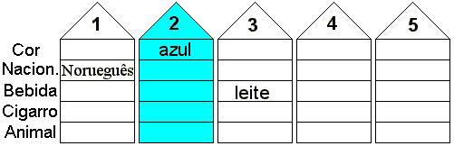
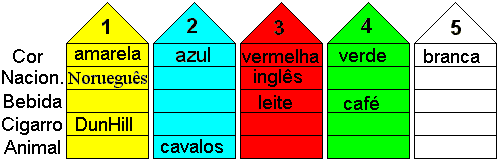
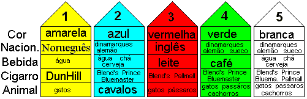
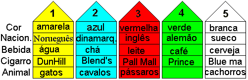

# Solução do Desafio de Einstein

## 1a. Fase:

Comece com o desenho de cinco casas, e cada casa com cinco espaços (um para cada característica), agora leia atentamente e veja as dicas que se enquadram direto, sem pensar muito. Estas dicas são a 8, 9 e 14, escreva cada característica dada no seu respectivo local! Assim temos:

## 2a. Fase:

Agora devemos olhar cada dica e ver as possibilidades erradas

1. Pela dica 4 a casa VERDE só pode ser a casa 3 ou 4 (pois ela estando à esquerda da branca, não pode ser a 1, a 2 já tem cor e a 5 não tem casa á sua esquerda).
1. Pela dica 5 vemos que a casa VERDE com CAFÉ só pode ser na casa 1, 4 ou 5 (pois as outras já têm cor ou bebida).
1. Agora juntando as dicas A e B, concluímos que a casa VERDE com CAFÉ é a 4, e conseqüentemente a BRANCA é a casa 5 (Dica 4)
1. Pela dica 1 o INGLÊS com a casa VERMELHA só pode ser a casa 3 (pois as outras já têm nacionalidade ou cor).
1. Na dica 7 o desafio fala de casa amarela, e como ainda não usamos a cor AMARELA, e somente a primeira está sem cor, então a casa 1 é a casa AMARELA e fuma DUNHILL.
1. Na dica 11 concluímos que a casa 2 cria CAVALOS.

Até agora temos:

## 3a. Fase:

1. Pronto, as possibilidades ditas “BARBADAS” já se esgotaram, devemos agora analisar TODAS dicas e ir anotando as possíveis possibilidades das características que faltam de cada casa.
1. A dica 2 diz que o SUECO tem CACHORROS, portanto só podem estar nas casas 4 ou 5 (pois as outras já têm nacionalidade ou animal)
1. Pela dica 3 o DINAMARQUÊS com o CHÁ só pode estar na casa 2 ou 5.
J- Pela dica 6 a pessoa que fuma PALL MALL cria pássaros, só podendo estar na casa 4 ou 5.
1. Colocamos BLENDS em todas casas sem cigarro até o momento e pela dica 10 colocamos gatos em todos vizinhos dos possíveis fumantes de blends.
1. Pela dica 12, só pode fumar BLUEMASTER e beber CERVEJA a casa 2 ou 5.
1. Pela dica 13 só temos a casa 2, 4 ou 5 para o ALEMÃO que fuma PRINCE.
1. Pela dica 15 colocamos ÁGUA nas casas 1, 2 e 5.

Fazendo todas estas anotações ficamos com o seguinte esquema:

## 4a. Fase:

1. Agora olhamos para casa 1 e vemos que as únicas possibilidades de bebida e animal para ela é ÁGUA e GATOS, portanto a casa 1 bebe água e cria gatos.
1. Pela dica 15 a casa 2 fuma BLEND’S
1. Pela dica 13 a casa 2 não pode ser do alemão, pois o proprietário desta casa fuma blend’s, então a casa 2 é do DINAMARQUÊS.
1. Pela dica 3 a casa 2 bebe CHÁ.
1. Novamente por exclusão, verificamos que a casa 5 só pode beber CERVEJA, portanto também fuma BLUEMASTER (dica 12)
1. Também por exclusão, a única casa que pode fumar PALL MALL é a 3.
1. Pela dica 6 a casa 3 cria PÁSSAROS.
1. Pela dica 13 a casa 4 é do ALEMÃO e fuma PRINCE.
1. Por exclusão a casa 5 é do SUECO
1. Pela dica 2 a casa 5 cria CACHORROS.

Com todos estes raciocínios, ficamos com a seguinte tabela:

## Resposta final:

Portanto, a única casa que pode ter PEIXES é a casa 4, pois não tem nenhum animal de estimação.
